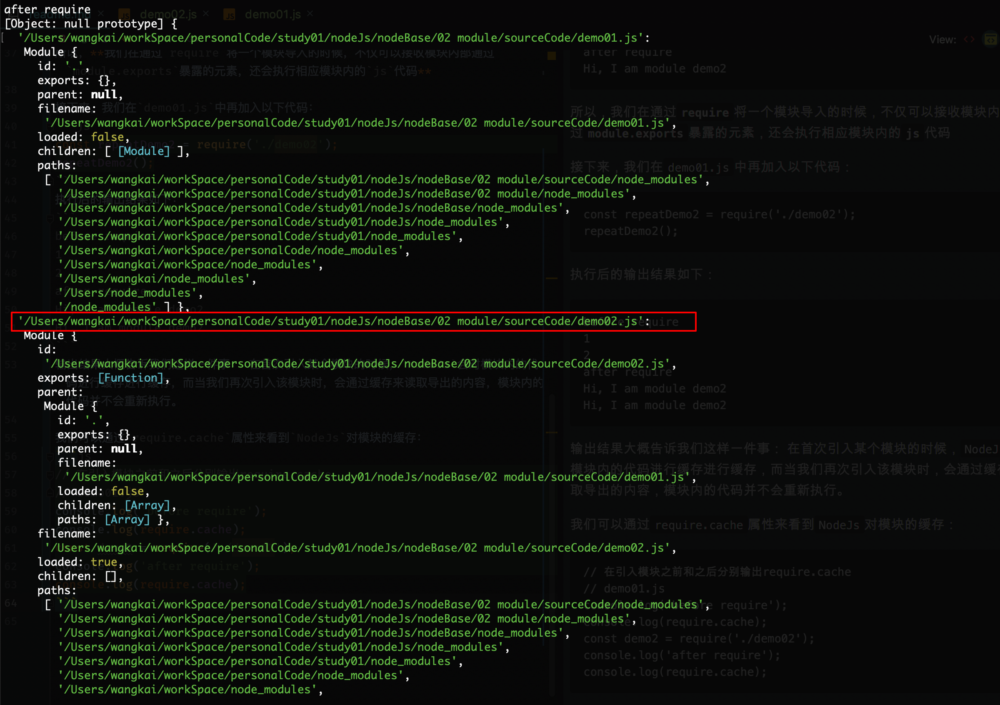

## `javascript`模块化
* `AMD` ： Asynchronous Module Definition
* `CMD` : Common Module Definition
* `UMD` : Universal Module Definition
* `ES6`模块化

推荐文章：  
* [前端模块化：CommonJS,AMD,CMD,ES6](https://juejin.im/post/5aaa37c8f265da23945f365c)

由于这里使用的是`Nodejs`,所以我们主要学习一些`CMD(commonJS)`的相关内容

### `NodeJs`中的模块化
#### `require`和`module.exports`使用
在`NodeJs`中，我们会通过`module.exports`或者`exports`来导出一个`javascript`文件中定义的元素，然后通过`require`将导出元素进行引入：  
```js
// demo02.js
console.log('1');
module.exports = () => {
  console.log('Hi, I am module demo2');
};
console.log('2');

// demo01.js
console.log('before require');
const demo2 = require('./demo02');
console.log('after require');
demo2();
```
接下来我们当前目录中打开命令行窗口，输入`node demo02.js`：  
```
before require
1
2
after require
Hi, I am module demo2
```

所以，**我们在通过`require`将一个模块导入的时候，不仅可以接收模块内部通过`module.exports`暴露的元素，还会执行相应模块内的`js`代码**

接下来，我们在`demo01.js`中再加入以下代码： 
```js
const repeatDemo2 = require('./demo02');
repeatDemo2();
```
执行后的输出结果如下： 
```
before require
1
2
after require
Hi, I am module demo2
Hi, I am module demo2
```
输出结果大概告诉我们这样一件事： 在首次引入某个模块的时候，`NodeJs`会对模块内的代码进行缓存进行缓存，而当我们再次引入该模块时，会通过缓存来读取导出的内容，模块内的代码并不会重新执行。  

我们可以通过`require.cache`属性来看到`NodeJs`对模块的缓存： 
```js
// 在引入模块之前和之后分别输出require.cache
// demo03.js
console.log('before require');
console.log(require.cache);
const demo2 = require('./demo02');
console.log('after require');
console.log(require.cache);
```
通过截图我们可以很明显的看出，在`require` `demo02`后缓存中多了一些内容:


在阅读完上边的代码之后，这里我们可以对`require`的功能进行一个小结：  
1. `require`会引入一个模块中通过`module.exports`导出的元素
2. 在`require`首次引入模块过程中，会执行模块文件中的代码，并将模块文件进行缓存
3. 当我们再次引入该模块的时候，会从缓存中读取该模块导出的元素，而不会再次运行该文件

### `exports`和`module.exports`
我们先看一下`NodeJs`官方对`exports`的定义：  
> `exports`变量是在模块的文件级作用域内可用的，且在模块执行之前赋值给`module.expors`

这句话的大概意思是说： `exports`并不是一个全局变量，只在模块文件内有效，并且在每个模块文件(`js`文件)执行之前将`module.exports`的值赋值给`exports`。即相当于在每个`js`文件的开头执行了如下代码：  
```js
exports = module.exports
```
这意味着`exports`和`module.exports`指向了同一片内存空间，当为`exports`或者`module.exports`重新赋值的时候，它们将不再指向同一个引用，而我们`requie`引入的一直都是`module.exports`导出的内容。  
```js
// demo04.js
// 本质上来讲：exports是module.exports的一个引用，它们指向同一片内存空间
// exports = module.exports
exports.a = 1;
module.exports = { b: 2 }; // 当引用发生变化的时候，exports不再是module.exports的快捷方式
```
这时模块暴露出来的对象是`{b:2}`。

官方也对这种行为进行了假设实现：  
```js
function require(/* ... */) {
  // 一个全局的module对象
  const module = { exports: {} };
  // 这里自执行函数传参时进行了赋值： exports = module.exports
  ((module, exports) => {
    // 模块代码在这。在这个例子中，定义了一个函数。
    function someFunc() {}
    exports = someFunc;
    // 此时，exports 不再是一个 module.exports 的快捷方式，
    // 且这个模块依然导出一个空的默认对象。
    module.exports = someFunc;
    // 此时，该模块导出 someFunc，而不是默认对象。
  })(module, module.exports);
  // 最终导出的一直都是module.exports,只不过可以通过exports来更改它们的引用，间接的改变module.exports
  return module.exports;
}
```
